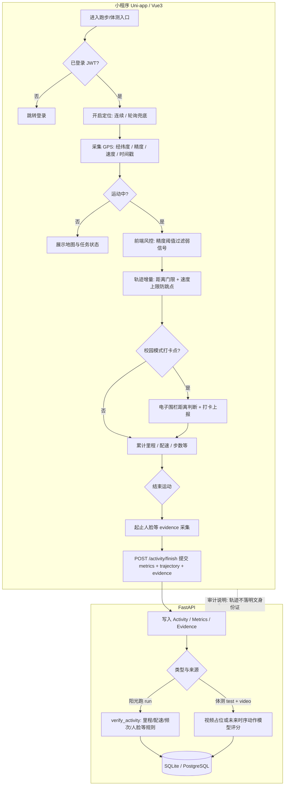
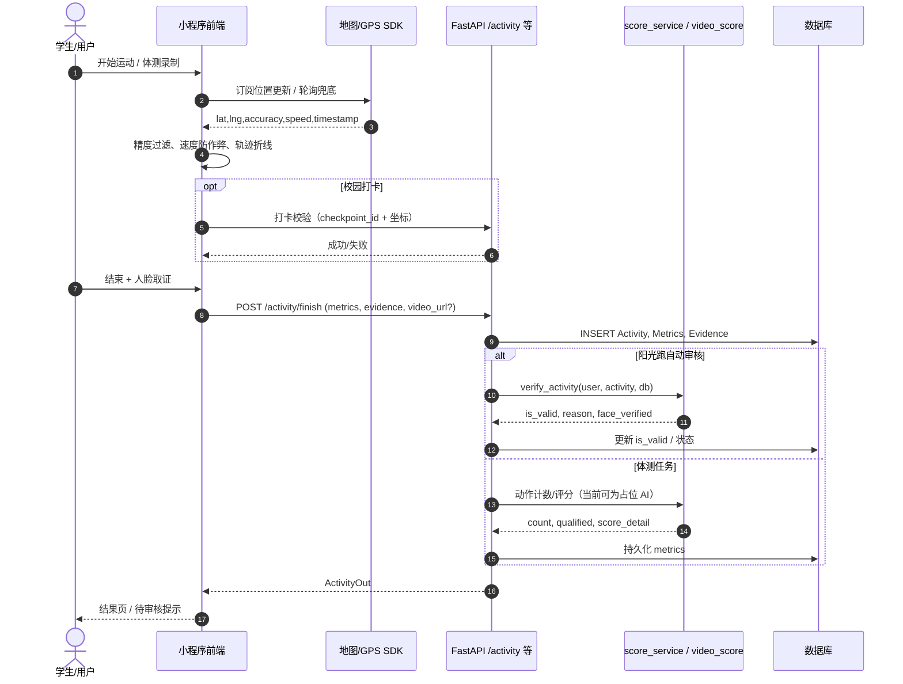
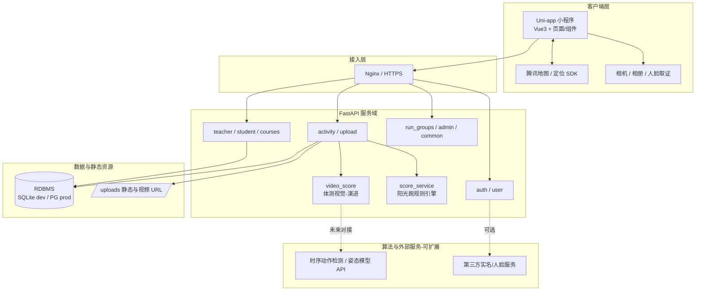

# Skill 3.1 — 项目架构可视化自动化封装

面向「翊晨运动 / 校园运动健康」小程序：**FastAPI 后端 + Uni-app（Vue3）前端 + GPS 轨迹与打卡 + 体测视频与 AI 评分（演进中）**。本 Skill 将「文字 / 代码 → 可审计架构图」固化为 **3 套 Mermaid 标准模板** + **1 条万能逻辑转换 Prompt**。

---

## 一、封装逻辑（What & Why）

| 层级 | 做法 |
|------|------|
| **标准化** | 全项目统一三类图：流程图（业务与风控决策）、时序图（跨端调用与数据落点）、模块拓扑（部署与依赖边界）。 |
| **可复用** | 节点命名约定：`FE_*` 小程序端、`API_*` 路由/服务、`SVC_*` 领域服务、`DATA_*` 存储与证据、`EXT_*` 外部能力（地图、人脸、未来时序动作模型）。 |
| **可审计** | 每张图在 README 或 PR 中注明：版本号、对应需求/接口、数据最小集（PII/轨迹/视频 URL 等），便于合规留痕。 |
| **与仓库对齐** | 示例贴合当前实现：如 `student-run` 侧 GPS 精度过滤、速度/跳变过滤、轨迹与打卡；`activity.finish` + `verify_activity` 规则；体测 `video_url` 与占位 AI 评分等。 |

---

## 二、调用方法（How to Invoke）

### 2.1 人工使用

1. 打开本文档 **第四节** 的「万能逻辑转换 Prompt」，整段复制到新对话（或 Cursor 里 `@` 本文件 + 粘贴计划书节选）。
2. 在 Prompt 末尾附上：计划书段落、相关接口路径、或关键源码片段。
3. 要求模型输出 **3 份代码块**：`flowchart` / `sequenceDiagram` / `graph TB`（或 `flowchart LR`），并与本文 **第三节** 的版式保持一致。

4. **要做计划书配图 / GPT 信息图时**：新开 Cursor 对话，`@.cursor/skills/mermaid-to-gpt-infographic/SKILL.md`，粘贴本次生成的 **流程图** fenced 代码；该技能会要求 Agent 写入 `docs/diagrams/fig-<主题>-flow.mmd`、给出 [mermaid.live](https://mermaid.live) 导出步骤与 **ChatGPT 生图提示词**（详见该 SKILL 的「标准流水线」与「Agent 交付清单」）。

### 2.2 与 CI / 文档联动（可选）

- 将生成的 Mermaid 存入 `docs/architecture/` 对应版本目录；PR 描述中嵌入缩略图或 Mermaid 源码。
- 审计包导出：Markdown + 同目录 PNG（由 Mermaid CLI 或文档站点渲染）。

---

## 三、三套标准 Mermaid 模板（翊晨运动 — 示例实例）

以下三套为 **可直接渲染** 的完整示例；新需求生成时应 **保留结构**（方向、参与者分层、注释块），替换节点与消息即可。

### 3.1 流程图模板 — 运动记录、GPS 防作弊与后端审核



### 3.2 时序图模板 — 从发起到落库与审核状态



### 3.3 模块拓扑图模板 — 前后端、数据与外部系统



---

## 四、万能逻辑转换 Prompt（复制即用）

将下方整段作为 **系统或用户消息前缀**；最后附上你的计划书原文、接口列表或代码路径说明。

```text
【角色】你是资深全栈架构师 + 数据合规/审计绘图专员。目标：把输入的文字或代码，转成 3 份 **可直接粘贴到 Markdown 的 Mermaid**，风格必须与「Skill 3.1」约定一致。

【输入】用户将提供：业务描述、数据流、接口、或源码片段（可能混杂中英文）。

【输出格式 — 严格按顺序输出 3 个 fenced 代码块】
1) 标题行：### 流程图（flowchart TD 或 LR）
   - 使用 subgraph 区分：FE（小程序）、API（FastAPI）、SVC（领域服务）、DATA（DB/对象存储）、EXT（地图/人脸/AI）。
   - 节点 ID 使用英文；**显示文本可用中文**。决策用 `{}`，关键风控/审计点用简短中文标注。
   - 必须包含至少一条「数据最小化/留痕」相关的注释边或节点（如轨迹、人脸 evidence、审核结果）。

2) 标题行：### 时序图（sequenceDiagram）
   - 参与者：User、FE、API、具体服务名（如 score_service）、DB；若有地图/GPS、AI 推理则单独 participant。
   - 使用 autonumber；对「异步/可选」用 opt/alt；标注关键请求字段（metrics、trajectory、evidence、video_url）但勿编造未给出的私密字段。

3) 标题行：### 模块拓扑（flowchart TB + subgraph）
   - 分层：客户端 / 接入层 / 服务域 / 数据与静态资源 / 外部与算法（Future）。
   - 用实线表示已存在依赖，虚线表示规划或对接中能力（如时序动作检测）。

【命名与风格约束】
- 与「翊晨运动」一致时：跑步 GPS 防作弊写清「精度过滤、速度上限、距离门限、轨迹上传」；后端写清「/activity/finish、verify_activity、体测视频与 AI 评分演进」。
- 不要输出 Mermaid 不支持的 HTML；少用括号嵌套；subgraph 标题简短。
- 若输入信息不足：在图前用 3～5 条「假设」列表说明，再作图；不要静默编造业务规则。

【自检】输出前检查：三类图是否 **同一故事三种视角**（决策流 / 调用顺序 / 部署边界），且可给审计人员单独阅读。
```

---

## 五、审计价值（Compliance & Review）

1. **可追溯**：流程图固定「谁在什么条件下写库、谁做自动审核」，便于对照日志与数据库字段（`Activity`、`ActivityMetrics`、`ActivityEvidence`）。
2. **跨团队对齐**：时序图减少「前端以为已校验 / 后端实际才校验」类争议；明确 GPS 与规则引擎边界。
3. **演进留痕**：拓扑图中 **Future** 虚线标注规划中的时序动作检测、外部人脸等，满足「规划 vs 实现」差距说明。
4. **复用降本**：同一 Prompt 产出三种视图，评审一次即可覆盖产品、研发、安全三方读法。

---

## 六、版本与维护

| 项目 | 说明 |
|------|------|
| **Skill 编号** | 3.1 |
| **默认路径** | `docs/skill-3.1/Skill_3.1_README.md` |
| **建议更新时机** | 新增核心路由、变更审核规则、接入真实 AI 推理链路、更换地图或存储方案 |

维护人可在 PR 中附上：更新后的 Mermaid 片段 + 一句「审计影响说明」（例如：新增字段、新增外部调用）。
